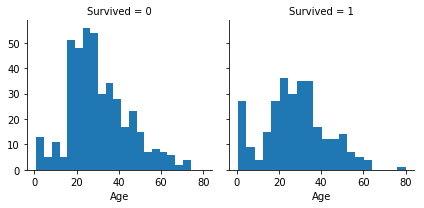
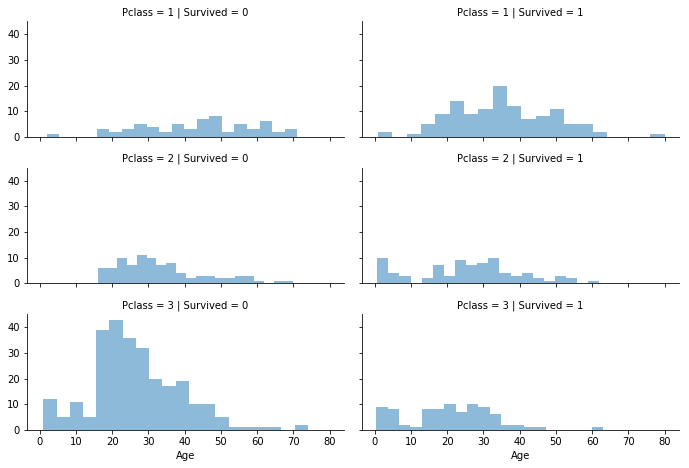
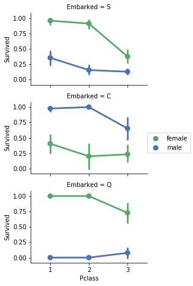
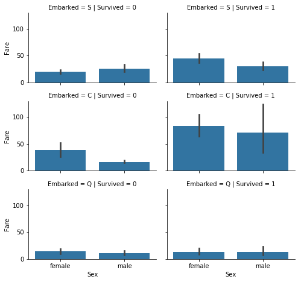
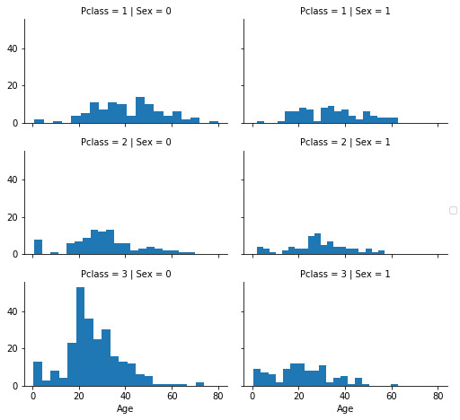

```python
### 导入工具
# data analysis and wrangling
import pandas as pd
import numpy as np
import random as rnd
import os
# visualization
import seaborn as sns
import matplotlib.pyplot as plt
%matplotlib inline

#machine learning
from sklearn.linear_model import LogisticRegression
from sklearn.svm import SVC,LinearSVC
from sklearn.ensemble import RandomForestClassifier
from sklearn.neighbors import KNeighborsClassifier
from sklearn.naive_bayes import GaussianNB
from sklearn.linear_model import Perceptron
from sklearn.linear_model import SGDClassifier
from sklearn.tree import DecisionTreeClassifier 
print('Import Done!')
```

    Import Done!
    


```python
#一、 Acquire data
print(os.getcwd())
os.chdir('D:\OuMeng\充电资料\Titanic-ML\Data')
print(os.listdir())
train_df = pd.read_csv('train.csv')
test_df = pd.read_csv('test.csv')
combine = [train_df,test_df]
```

    D:\OuMeng\充电资料\Titanic-ML\Data
    ['gender_submission.csv', 'Processed_test_df.csv', 'Processed_train_df.csv', 'test.csv', 'train.csv']
    


```python
#二、 Describing data
# 此处为对数据的认知，首先描述数据，分析数据，然后矫正数据
print(train_df.columns.values)
train_df.head()
```

    ['PassengerId' 'Survived' 'Pclass' 'Name' 'Sex' 'Age' 'SibSp' 'Parch'
     'Ticket' 'Fare' 'Cabin' 'Embarked']
    


<table border="1" class="dataframe">
  <thead>
    <tr style="text-align: right;">
      <th></th>
      <th>PassengerId</th>
      <th>Survived</th>
      <th>Pclass</th>
      <th>Name</th>
      <th>Sex</th>
      <th>Age</th>
      <th>SibSp</th>
      <th>Parch</th>
      <th>Ticket</th>
      <th>Fare</th>
      <th>Cabin</th>
      <th>Embarked</th>
    </tr>
  </thead>
  <tbody>
    <tr>
      <th>0</th>
      <td>1</td>
      <td>0</td>
      <td>3</td>
      <td>Braund, Mr. Owen Harris</td>
      <td>male</td>
      <td>22.0</td>
      <td>1</td>
      <td>0</td>
      <td>A/5 21171</td>
      <td>7.2500</td>
      <td>NaN</td>
      <td>S</td>
    </tr>
    <tr>
      <th>1</th>
      <td>2</td>
      <td>1</td>
      <td>1</td>
      <td>Cumings, Mrs. John Bradley (Florence Briggs Th...</td>
      <td>female</td>
      <td>38.0</td>
      <td>1</td>
      <td>0</td>
      <td>PC 17599</td>
      <td>71.2833</td>
      <td>C85</td>
      <td>C</td>
    </tr>
    <tr>
      <th>2</th>
      <td>3</td>
      <td>1</td>
      <td>3</td>
      <td>Heikkinen, Miss. Laina</td>
      <td>female</td>
      <td>26.0</td>
      <td>0</td>
      <td>0</td>
      <td>STON/O2. 3101282</td>
      <td>7.9250</td>
      <td>NaN</td>
      <td>S</td>
    </tr>
    <tr>
      <th>3</th>
      <td>4</td>
      <td>1</td>
      <td>1</td>
      <td>Futrelle, Mrs. Jacques Heath (Lily May Peel)</td>
      <td>female</td>
      <td>35.0</td>
      <td>1</td>
      <td>0</td>
      <td>113803</td>
      <td>53.1000</td>
      <td>C123</td>
      <td>S</td>
    </tr>
    <tr>
      <th>4</th>
      <td>5</td>
      <td>0</td>
      <td>3</td>
      <td>Allen, Mr. William Henry</td>
      <td>male</td>
      <td>35.0</td>
      <td>0</td>
      <td>0</td>
      <td>373450</td>
      <td>8.0500</td>
      <td>NaN</td>
      <td>S</td>
    </tr>
  </tbody>
</table>


```python
#(2.1) 描述数据基本描述
# 分类Categorical : Survival,Sex,and Embarked. 
# 次序Ordinal：Pclass
# 连续Continous：Age，Fare，
# 离散Discrete: SibSp，Parch
# Ticket/Carbin： 是一列由数字和字母组成的数据
# Name: 是一列可能出现错误的数据
# Cabin/Age/Embarked 是包含blank、null、empty values值得数据

# train_df.info()
# test_df.info()
#以上；7列是整数和浮点数数据，5列是字符串数据

```


```python
#(2,2) 具体描述

#   数值型数据
#    Total samples are 891 or 40% of the actual number of passengers on board the Titanic (2,224).
#    Survived is a categorical feature with 0 or 1 values.
#    Around 38% samples survived representative of the actual survival rate at 32%.
#    Most passengers (> 75%) did not travel with parents or children.
#    Nearly 30% of the passengers had siblings and/or spouse aboard.
#    Fares varied significantly with few passengers (<1%) paying as high as $512.
#    Few elderly passengers (<1%) within age range 65-80.

train_df.describe()
```


<div>
<table border="1" class="dataframe">
  <thead>
    <tr style="text-align: right;">
      <th></th>
      <th>PassengerId</th>
      <th>Survived</th>
      <th>Pclass</th>
      <th>Age</th>
      <th>SibSp</th>
      <th>Parch</th>
      <th>Fare</th>
    </tr>
  </thead>
  <tbody>
    <tr>
      <th>count</th>
      <td>891.000000</td>
      <td>891.000000</td>
      <td>891.000000</td>
      <td>714.000000</td>
      <td>891.000000</td>
      <td>891.000000</td>
      <td>891.000000</td>
    </tr>
    <tr>
      <th>mean</th>
      <td>446.000000</td>
      <td>0.383838</td>
      <td>2.308642</td>
      <td>29.699118</td>
      <td>0.523008</td>
      <td>0.381594</td>
      <td>32.204208</td>
    </tr>
    <tr>
      <th>std</th>
      <td>257.353842</td>
      <td>0.486592</td>
      <td>0.836071</td>
      <td>14.526497</td>
      <td>1.102743</td>
      <td>0.806057</td>
      <td>49.693429</td>
    </tr>
    <tr>
      <th>min</th>
      <td>1.000000</td>
      <td>0.000000</td>
      <td>1.000000</td>
      <td>0.420000</td>
      <td>0.000000</td>
      <td>0.000000</td>
      <td>0.000000</td>
    </tr>
    <tr>
      <th>25%</th>
      <td>223.500000</td>
      <td>0.000000</td>
      <td>2.000000</td>
      <td>20.125000</td>
      <td>0.000000</td>
      <td>0.000000</td>
      <td>7.910400</td>
    </tr>
    <tr>
      <th>50%</th>
      <td>446.000000</td>
      <td>0.000000</td>
      <td>3.000000</td>
      <td>28.000000</td>
      <td>0.000000</td>
      <td>0.000000</td>
      <td>14.454200</td>
    </tr>
    <tr>
      <th>75%</th>
      <td>668.500000</td>
      <td>1.000000</td>
      <td>3.000000</td>
      <td>38.000000</td>
      <td>1.000000</td>
      <td>0.000000</td>
      <td>31.000000</td>
    </tr>
    <tr>
      <th>max</th>
      <td>891.000000</td>
      <td>1.000000</td>
      <td>3.000000</td>
      <td>80.000000</td>
      <td>8.000000</td>
      <td>6.000000</td>
      <td>512.329200</td>
    </tr>
  </tbody>
</table>
</div>


```python
#（2,3,1）整体description 分析数据
   # Names are unique across the dataset (count=unique=891)
   # Sex variable as two possible values with 65% male (top=male, freq=577/count=891).
   # Cabin values have several dupicates across samples. Alternatively several passengers shared a cabin.
   # Embarked takes three possible values. S port used by most passengers (top=S)
   # Ticket feature has high ratio (22%) of duplicate values (unique=681).
train_df.describe(include=['O'])
```


<div>
<style scoped>
    .dataframe tbody tr th:only-of-type {
        vertical-align: middle;
    }

    .dataframe tbody tr th {
        vertical-align: top;
    }

    .dataframe thead th {
        text-align: right;
    }
</style>
<table border="1" class="dataframe">
  <thead>
    <tr style="text-align: right;">
      <th></th>
      <th>Name</th>
      <th>Sex</th>
      <th>Ticket</th>
      <th>Cabin</th>
      <th>Embarked</th>
    </tr>
  </thead>
  <tbody>
    <tr>
      <th>count</th>
      <td>891</td>
      <td>891</td>
      <td>891</td>
      <td>204</td>
      <td>889</td>
    </tr>
    <tr>
      <th>unique</th>
      <td>891</td>
      <td>2</td>
      <td>681</td>
      <td>147</td>
      <td>3</td>
    </tr>
    <tr>
      <th>top</th>
      <td>Lehmann, Miss. Bertha</td>
      <td>male</td>
      <td>1601</td>
      <td>C23 C25 C27</td>
      <td>S</td>
    </tr>
    <tr>
      <th>freq</th>
      <td>1</td>
      <td>577</td>
      <td>7</td>
      <td>4</td>
      <td>644</td>
    </tr>
  </tbody>
</table>
</div>


```python
# 相关性分析
# 相关性 Pclass
train_df[['Pclass','Survived']].groupby(['Pclass']).mean().\
sort_values(by='Survived',ascending=False)

```


<div>
<table border="1" class="dataframe">
  <thead>
    <tr style="text-align: right;">
      <th></th>
      <th>Survived</th>
    </tr>
    <tr>
      <th>Pclass</th>
      <th></th>
    </tr>
  </thead>
  <tbody>
    <tr>
      <th>1</th>
      <td>0.629630</td>
    </tr>
    <tr>
      <th>2</th>
      <td>0.472826</td>
    </tr>
    <tr>
      <th>3</th>
      <td>0.242363</td>
    </tr>
  </tbody>
</table>
</div>


```python
# 相关性 Sex
train_df[['Sex',"Survived"]].groupby(['Sex'],as_index=False).mean().\
sort_values(by='Survived',ascending=False)
```


<div>

<table border="1" class="dataframe">
  <thead>
    <tr style="text-align: right;">
      <th></th>
      <th>Sex</th>
      <th>Survived</th>
    </tr>
  </thead>
  <tbody>
    <tr>
      <th>0</th>
      <td>female</td>
      <td>0.742038</td>
    </tr>
    <tr>
      <th>1</th>
      <td>male</td>
      <td>0.188908</td>
    </tr>
  </tbody>
</table>
</div>


```python
# 相关性 SibSp
train_df[['SibSp','Survived']].groupby(['SibSp'],as_index=False).mean().\
sort_values(by='Survived',ascending=False)
```


<div>
<table border="1" class="dataframe">
  <thead>
    <tr style="text-align: right;">
      <th></th>
      <th>SibSp</th>
      <th>Survived</th>
    </tr>
  </thead>
  <tbody>
    <tr>
      <th>1</th>
      <td>1</td>
      <td>0.535885</td>
    </tr>
    <tr>
      <th>2</th>
      <td>2</td>
      <td>0.464286</td>
    </tr>
    <tr>
      <th>0</th>
      <td>0</td>
      <td>0.345395</td>
    </tr>
    <tr>
      <th>3</th>
      <td>3</td>
      <td>0.250000</td>
    </tr>
    <tr>
      <th>4</th>
      <td>4</td>
      <td>0.166667</td>
    </tr>
    <tr>
      <th>5</th>
      <td>5</td>
      <td>0.000000</td>
    </tr>
    <tr>
      <th>6</th>
      <td>8</td>
      <td>0.000000</td>
    </tr>
  </tbody>
</table>
</div>


```python
# 相关性 Parch
train_df[['Parch','Survived']].groupby(['Parch'],as_index=False).mean().\
sort_values(by='Survived',ascending=False)
```


<div>
<table border="1" class="dataframe">
  <thead>
    <tr style="text-align: right;">
      <th></th>
      <th>Parch</th>
      <th>Survived</th>
    </tr>
  </thead>
  <tbody>
    <tr>
      <th>3</th>
      <td>3</td>
      <td>0.600000</td>
    </tr>
    <tr>
      <th>1</th>
      <td>1</td>
      <td>0.550847</td>
    </tr>
    <tr>
      <th>2</th>
      <td>2</td>
      <td>0.500000</td>
    </tr>
    <tr>
      <th>0</th>
      <td>0</td>
      <td>0.343658</td>
    </tr>
    <tr>
      <th>5</th>
      <td>5</td>
      <td>0.200000</td>
    </tr>
    <tr>
      <th>4</th>
      <td>4</td>
      <td>0.000000</td>
    </tr>
    <tr>
      <th>6</th>
      <td>6</td>
      <td>0.000000</td>
    </tr>
  </tbody>
</table>
</div>


```python
# 相关性 Age
g = sns.FacetGrid(train_df,col='Survived')
g.map(plt.hist,'Age',bins=20)
```


    <seaborn.axisgrid.FacetGrid at 0x234c9b70>





```python
# 相关性 Age and Pclass
grid = sns.FacetGrid(train_df,col='Survived',row='Pclass',size=2.2,aspect=2.2)
grid.map(plt.hist,'Age',alpha=.5,bins=20)
#grid.add_legend();
```


    <seaborn.axisgrid.FacetGrid at 0x22f3a128>





```python
# 相关性 Embarked 
grid = sns.FacetGrid(train_df,row = 'Embarked',size=2.2,aspect=1.6)
grid.map(sns.pointplot,'Pclass','Survived','Sex',palette='deep')
grid.add_legend()
```

    C:\ProgramData\Anaconda3\lib\site-packages\seaborn\axisgrid.py:703: UserWarning: Using the pointplot function without specifying `order` is likely to produce an incorrect plot.
      warnings.warn(warning)
    C:\ProgramData\Anaconda3\lib\site-packages\seaborn\axisgrid.py:708: UserWarning: Using the pointplot function without specifying `hue_order` is likely to produce an incorrect plot.
      warnings.warn(warning)
    


    <seaborn.axisgrid.FacetGrid at 0x235af390>





```python
# 相关性 Fare Embarked 
grid = sns.FacetGrid(train_df,row = 'Embarked',col='Survived',size=2.2,aspect=1.6)
grid.map(sns.barplot,'Sex','Fare')
```

    C:\ProgramData\Anaconda3\lib\site-packages\seaborn\axisgrid.py:703: UserWarning: Using the barplot function without specifying `order` is likely to produce an incorrect plot.
      warnings.warn(warning)
    


    <seaborn.axisgrid.FacetGrid at 0x22f3ac88>





```python
# 三，矫正数据

#3.1 去掉无用的 Ticket 、Cabin
print('Before',train_df.shape,test_df.shape,combine[0].shape,combine[1].shape)
train_df = train_df.drop(['Ticket','Cabin'],axis=1)
test_df = test_df.drop(['Ticket','Cabin'],axis=1)
combine = [train_df,test_df]
print('After',train_df.shape,test_df.shape,combine[0].shape,combine[1].shape)
```

    Before (891, 12) (418, 11) (891, 12) (418, 11)
    After (891, 10) (418, 9) (891, 10) (418, 9)
    


```python
#3.2 将Name 一列矫正，首先利用正则表达提取关键词。
for dataset in combine:
    dataset['Title'] = dataset.Name.str.extract(' ([A-Za-z]+)\.',expand=False)
#pd.crosstab(train_df['Title'],train_df['Sex'])

for dataset in combine:
    dataset['Title'] = dataset['Title'].replace(['Lady','Countess','Capt','Col',\
    'Don','Dr','Major','Rev','Sir','Jonkheer','Done'],'Rare')
    dataset['Title'] = dataset['Title'].replace('Mlle','Miss')
    dataset['Title'] = dataset['Title'].replace('Ms','Miss')
    dataset['Title'] = dataset['Title'].replace('Mme','Mrs')
#train_df[['Title','Survived']].groupby(['Title'],as_index=False).mean()

tittle_mapping = {'Mr':1,'Miss':2,'Mrs':3,'Master':4,'Rare':5}
for dataset in combine:
    dataset['Title'] = dataset['Title'].map(tittle_mapping)
    dataset['Title'] = dataset['Title'].fillna(0)
    
#train_df.head()
#矫正时候删掉Name 列
train_df = train_df.drop(['Name','PassengerId'],axis=1)
test_df = test_df.drop(['Name'],axis=1)
combine = [train_df,test_df]
train_df.shape,test_df.shape
```


    ((891, 9), (418, 9))


```python
# 3.3 将 Sex 列变为数字型

for dataset in combine:
    dataset['Sex'] = dataset['Sex'].map({'female':1,'male':0}).astype(int)
train_df.tail()
```


<div>
<table border="1" class="dataframe">
  <thead>
    <tr style="text-align: right;">
      <th></th>
      <th>Survived</th>
      <th>Pclass</th>
      <th>Sex</th>
      <th>Age</th>
      <th>SibSp</th>
      <th>Parch</th>
      <th>Fare</th>
      <th>Embarked</th>
      <th>Title</th>
    </tr>
  </thead>
  <tbody>
    <tr>
      <th>886</th>
      <td>0</td>
      <td>2</td>
      <td>0</td>
      <td>27.0</td>
      <td>0</td>
      <td>0</td>
      <td>13.00</td>
      <td>S</td>
      <td>5</td>
    </tr>
    <tr>
      <th>887</th>
      <td>1</td>
      <td>1</td>
      <td>1</td>
      <td>19.0</td>
      <td>0</td>
      <td>0</td>
      <td>30.00</td>
      <td>S</td>
      <td>2</td>
    </tr>
    <tr>
      <th>888</th>
      <td>0</td>
      <td>3</td>
      <td>1</td>
      <td>NaN</td>
      <td>1</td>
      <td>2</td>
      <td>23.45</td>
      <td>S</td>
      <td>2</td>
    </tr>
    <tr>
      <th>889</th>
      <td>1</td>
      <td>1</td>
      <td>0</td>
      <td>26.0</td>
      <td>0</td>
      <td>0</td>
      <td>30.00</td>
      <td>C</td>
      <td>1</td>
    </tr>
    <tr>
      <th>890</th>
      <td>0</td>
      <td>3</td>
      <td>0</td>
      <td>32.0</td>
      <td>0</td>
      <td>0</td>
      <td>7.75</td>
      <td>Q</td>
      <td>1</td>
    </tr>
  </tbody>
</table>
</div>


```python
# 3.4 填充Age 列的空值：
# 作者提到了三种方法:
# 1、 一种直接的方法，直接使用均值替换
# 2、 第二种使用更准确的方法，使用与Age相关的数据辅助填充缺失值；此处使用与年龄相关的 Gender 与 Pclass，
#     由于Pclass 与 Gender确定，已知；使用其它数据中Pclass 与 Gender 已知 的中值。
# 3、综合两种方法，随机使用第一种或者第二种方法的值
# 在这我们使用第二种方法。

grid = sns.FacetGrid(train_df,row='Pclass',col='Sex',size=2.2,aspect=1.6)
grid.map(plt.hist,'Age',bins=20)
grid.add_legend()
```


    <seaborn.axisgrid.FacetGrid at 0x23130588>





```python
guess_ages = np.zeros((2,3))
for dataset in combine:
    for i in range(0,2):
        for j in range(0,3):
            guess_df = dataset[dataset['Sex']==i &\
                        (dataset['Pclass']==j+1)]['Age'].dropna()
            age_guess = guess_df.median()
            
            guess_ages[i,j] = int(age_guess/0.5 + 0.5)*0.5
    #print(age_guess)
    #print(guess_ages)
    for i in range(0,2):
        for j in range(0,3):
            dataset.loc[(dataset.Age.isnull()) & (dataset.Sex==i)& (dataset.Pclass == j+1),\
                       'Age'] = guess_ages[i,j] 
            
    dataset['Age'] = dataset['Age'].astype(int)
train_df.tail()

```


<div>
<table border="1" class="dataframe">
  <thead>
    <tr style="text-align: right;">
      <th></th>
      <th>Survived</th>
      <th>Pclass</th>
      <th>Sex</th>
      <th>Age</th>
      <th>SibSp</th>
      <th>Parch</th>
      <th>Fare</th>
      <th>Embarked</th>
      <th>Title</th>
    </tr>
  </thead>
  <tbody>
    <tr>
      <th>886</th>
      <td>0</td>
      <td>2</td>
      <td>0</td>
      <td>27</td>
      <td>0</td>
      <td>0</td>
      <td>13.00</td>
      <td>S</td>
      <td>5</td>
    </tr>
    <tr>
      <th>887</th>
      <td>1</td>
      <td>1</td>
      <td>1</td>
      <td>19</td>
      <td>0</td>
      <td>0</td>
      <td>30.00</td>
      <td>S</td>
      <td>2</td>
    </tr>
    <tr>
      <th>888</th>
      <td>0</td>
      <td>3</td>
      <td>1</td>
      <td>30</td>
      <td>1</td>
      <td>2</td>
      <td>23.45</td>
      <td>S</td>
      <td>2</td>
    </tr>
    <tr>
      <th>889</th>
      <td>1</td>
      <td>1</td>
      <td>0</td>
      <td>26</td>
      <td>0</td>
      <td>0</td>
      <td>30.00</td>
      <td>C</td>
      <td>1</td>
    </tr>
    <tr>
      <th>890</th>
      <td>0</td>
      <td>3</td>
      <td>0</td>
      <td>32</td>
      <td>0</td>
      <td>0</td>
      <td>7.75</td>
      <td>Q</td>
      <td>1</td>
    </tr>
  </tbody>
</table>
</div>


```python
train_df['AgeBand'] = pd.cut(train_df['Age'], 5)
train_df[['AgeBand', 'Survived']].groupby(['AgeBand'], as_index=False).mean().\
sort_values(by='AgeBand', ascending=True)
```


<div>
<table border="1" class="dataframe">
  <thead>
    <tr style="text-align: right;">
      <th></th>
      <th>AgeBand</th>
      <th>Survived</th>
    </tr>
  </thead>
  <tbody>
    <tr>
      <th>0</th>
      <td>(-0.08, 16.0]</td>
      <td>0.550000</td>
    </tr>
    <tr>
      <th>1</th>
      <td>(16.0, 32.0]</td>
      <td>0.344762</td>
    </tr>
    <tr>
      <th>2</th>
      <td>(32.0, 48.0]</td>
      <td>0.403226</td>
    </tr>
    <tr>
      <th>3</th>
      <td>(48.0, 64.0]</td>
      <td>0.434783</td>
    </tr>
    <tr>
      <th>4</th>
      <td>(64.0, 80.0]</td>
      <td>0.090909</td>
    </tr>
  </tbody>
</table>
</div>


```python
for dataset in combine:
    dataset.loc[dataset['Age'] <=16,'Age']=0
    dataset.loc[(dataset['Age'] > 16) & (dataset['Age'] <= 32),'Age'] = 1
    dataset.loc[(dataset['Age'] > 32) & (dataset['Age'] <= 48),'Age'] = 2
    dataset.loc[(dataset['Age'] > 48) & (dataset['Age'] <=64),'Age' ] = 3
    dataset.loc[(dataset['Age'] > 64,'Age')]
train_df.tail()
```


<div>
<table border="1" class="dataframe">
  <thead>
    <tr style="text-align: right;">
      <th></th>
      <th>Survived</th>
      <th>Pclass</th>
      <th>Sex</th>
      <th>Age</th>
      <th>SibSp</th>
      <th>Parch</th>
      <th>Fare</th>
      <th>Embarked</th>
      <th>Title</th>
      <th>AgeBand</th>
    </tr>
  </thead>
  <tbody>
    <tr>
      <th>886</th>
      <td>0</td>
      <td>2</td>
      <td>0</td>
      <td>1</td>
      <td>0</td>
      <td>0</td>
      <td>13.00</td>
      <td>S</td>
      <td>5</td>
      <td>(16.0, 32.0]</td>
    </tr>
    <tr>
      <th>887</th>
      <td>1</td>
      <td>1</td>
      <td>1</td>
      <td>1</td>
      <td>0</td>
      <td>0</td>
      <td>30.00</td>
      <td>S</td>
      <td>2</td>
      <td>(16.0, 32.0]</td>
    </tr>
    <tr>
      <th>888</th>
      <td>0</td>
      <td>3</td>
      <td>1</td>
      <td>1</td>
      <td>1</td>
      <td>2</td>
      <td>23.45</td>
      <td>S</td>
      <td>2</td>
      <td>(16.0, 32.0]</td>
    </tr>
    <tr>
      <th>889</th>
      <td>1</td>
      <td>1</td>
      <td>0</td>
      <td>1</td>
      <td>0</td>
      <td>0</td>
      <td>30.00</td>
      <td>C</td>
      <td>1</td>
      <td>(16.0, 32.0]</td>
    </tr>
    <tr>
      <th>890</th>
      <td>0</td>
      <td>3</td>
      <td>0</td>
      <td>1</td>
      <td>0</td>
      <td>0</td>
      <td>7.75</td>
      <td>Q</td>
      <td>1</td>
      <td>(16.0, 32.0]</td>
    </tr>
  </tbody>
</table>
</div>


```python
train_df = train_df.drop(['AgeBand'],axis = 1)
combine = [train_df,test_df]
train_df.head()
```


<div>
<table border="1" class="dataframe">
  <thead>
    <tr style="text-align: right;">
      <th></th>
      <th>Survived</th>
      <th>Pclass</th>
      <th>Sex</th>
      <th>Age</th>
      <th>SibSp</th>
      <th>Parch</th>
      <th>Fare</th>
      <th>Embarked</th>
      <th>Title</th>
    </tr>
  </thead>
  <tbody>
    <tr>
      <th>0</th>
      <td>0</td>
      <td>3</td>
      <td>0</td>
      <td>1</td>
      <td>1</td>
      <td>0</td>
      <td>7.2500</td>
      <td>S</td>
      <td>1</td>
    </tr>
    <tr>
      <th>1</th>
      <td>1</td>
      <td>1</td>
      <td>1</td>
      <td>2</td>
      <td>1</td>
      <td>0</td>
      <td>71.2833</td>
      <td>C</td>
      <td>3</td>
    </tr>
    <tr>
      <th>2</th>
      <td>1</td>
      <td>3</td>
      <td>1</td>
      <td>1</td>
      <td>0</td>
      <td>0</td>
      <td>7.9250</td>
      <td>S</td>
      <td>2</td>
    </tr>
    <tr>
      <th>3</th>
      <td>1</td>
      <td>1</td>
      <td>1</td>
      <td>2</td>
      <td>1</td>
      <td>0</td>
      <td>53.1000</td>
      <td>S</td>
      <td>3</td>
    </tr>
    <tr>
      <th>4</th>
      <td>0</td>
      <td>3</td>
      <td>0</td>
      <td>2</td>
      <td>0</td>
      <td>0</td>
      <td>8.0500</td>
      <td>S</td>
      <td>1</td>
    </tr>
  </tbody>
</table>
</div>


```python
# 3.4 人工的加上一列，Sibsp 与 Parch，一列表示兄弟姐妹的数量，一列表示家人的数量
#   所以将两列合并为一列，Familysize，最终得到一列，就是这名乘客是否孤身一身乘船
#   IsAlone
for dataset in combine:
    dataset['FamilySize'] = dataset['SibSp'] + dataset['Parch'] + 1
train_df[['FamilySize','Survived']].groupby(['FamilySize'],as_index=False).mean().\
sort_values(by = 'Survived',ascending = False)
```


<div>
<table border="1" class="dataframe">
  <thead>
    <tr style="text-align: right;">
      <th></th>
      <th>FamilySize</th>
      <th>Survived</th>
    </tr>
  </thead>
  <tbody>
    <tr>
      <th>3</th>
      <td>4</td>
      <td>0.724138</td>
    </tr>
    <tr>
      <th>2</th>
      <td>3</td>
      <td>0.578431</td>
    </tr>
    <tr>
      <th>1</th>
      <td>2</td>
      <td>0.552795</td>
    </tr>
    <tr>
      <th>6</th>
      <td>7</td>
      <td>0.333333</td>
    </tr>
    <tr>
      <th>0</th>
      <td>1</td>
      <td>0.303538</td>
    </tr>
    <tr>
      <th>4</th>
      <td>5</td>
      <td>0.200000</td>
    </tr>
    <tr>
      <th>5</th>
      <td>6</td>
      <td>0.136364</td>
    </tr>
    <tr>
      <th>7</th>
      <td>8</td>
      <td>0.000000</td>
    </tr>
    <tr>
      <th>8</th>
      <td>11</td>
      <td>0.000000</td>
    </tr>
  </tbody>
</table>
</div>


```python
for dataset in combine:
    dataset['IsAlone'] = 0
    dataset.loc[dataset['FamilySize'] == 1,'IsAlone'] =1

train_df[['IsAlone','Survived']].groupby(['IsAlone'],as_index=False).mean()
```


<div>
<table border="1" class="dataframe">
  <thead>
    <tr style="text-align: right;">
      <th></th>
      <th>IsAlone</th>
      <th>Survived</th>
    </tr>
  </thead>
  <tbody>
    <tr>
      <th>0</th>
      <td>0</td>
      <td>0.505650</td>
    </tr>
    <tr>
      <th>1</th>
      <td>1</td>
      <td>0.303538</td>
    </tr>
  </tbody>
</table>
</div>


```python
train_df = train_df.drop(['Parch','SibSp','FamilySize'],axis = 1)
test_df = test_df.drop(['Parch','SibSp','FamilySize'],axis = 1)
combine = [train_df,test_df]

```

         Survived  Pclass  Sex  Age   Fare Embarked  Title  IsAlone
    886         0       2    0    1  13.00        S      5        1
    887         1       1    1    1  30.00        S      2        1
    888         0       3    1    1  23.45        S      2        0
    889         1       1    0    1  30.00        C      1        1
    890         0       3    0    1   7.75        Q      1        1
         PassengerId  Pclass  Sex  Age      Fare Embarked  Title  IsAlone
    413         1305       3    0    1    8.0500        S    1.0        1
    414         1306       1    1    2  108.9000        C    0.0        1
    415         1307       3    0    2    7.2500        S    1.0        1
    416         1308       3    0    1    8.0500        S    1.0        1
    417         1309       3    0    1   22.3583        C    4.0        0
    


```python
# 3.5 人工添加一列，Age * Pclass
for dataset in combine:
    dataset['Age*Class'] = dataset.Age*dataset.Pclass

```


```python
# 3.6 Embarked 为登船的口岸，直接用众数添加缺失值；然后变为Numberic
freq_port = train_df.Embarked.dropna().mode()[0]

#填充缺失
for dataset in combine:
    dataset['Embarked'] = dataset['Embarked'].fillna(freq_port)
#train_df[['Embarked','Survived']].groupby(['Embarked'],as_index=False).mean().\
#sort_values(by = 'Survived',ascending = False)

#Numberic
for dataset in combine:
    dataset['Embarked'] = dataset['Embarked'].map({'S':0,'C':1,'Q':2}).astype(int)
print(train_df.tail())
print(test_df.tail())
```

         Survived  Pclass  Sex  Age   Fare  Embarked  Title  IsAlone
    886         0       2    0    1  13.00         0      5        1
    887         1       1    1    1  30.00         0      2        1
    888         0       3    1    1  23.45         0      2        0
    889         1       1    0    1  30.00         1      1        1
    890         0       3    0    1   7.75         2      1        1
         PassengerId  Pclass  Sex  Age      Fare  Embarked  Title  IsAlone
    413         1305       3    0    1    8.0500         0    1.0        1
    414         1306       1    1    2  108.9000         1    0.0        1
    415         1307       3    0    2    7.2500         0    1.0        1
    416         1308       3    0    1    8.0500         0    1.0        1
    417         1309       3    0    1   22.3583         1    4.0        0
    


```python
# 3.7 改变价格列，分价格等级
test_df['Fare'].fillna(test_df['Fare'].dropna().median(),inplace=True)
train_df['FareBand'] = pd.qcut(train_df['Fare'],4)
for dataset in combine:
    dataset.loc[dataset['Fare'] <= 7.91,'Fare'] = 0
    dataset.loc[(dataset['Fare'] > 7.91) & (dataset['Fare'] <= 14.454),'Fare' ] =1
    dataset.loc[(dataset['Fare'] > 14.454) & (dataset['Fare'] <= 31),'Fare'] = 2
    dataset.loc[dataset['Fare'] >31,'Fare'] = 3
    dataset['Fare'] = dataset['Fare'].astype(int)

train_df = train_df.drop(['FareBand'],axis =1)
combine = [train_df,test_df]
train_df.tail()
```


<div>
<table border="1" class="dataframe">
  <thead>
    <tr style="text-align: right;">
      <th></th>
      <th>Survived</th>
      <th>Pclass</th>
      <th>Sex</th>
      <th>Age</th>
      <th>Fare</th>
      <th>Embarked</th>
      <th>Title</th>
      <th>IsAlone</th>
    </tr>
  </thead>
  <tbody>
    <tr>
      <th>886</th>
      <td>0</td>
      <td>2</td>
      <td>0</td>
      <td>1</td>
      <td>1</td>
      <td>0</td>
      <td>5</td>
      <td>1</td>
    </tr>
    <tr>
      <th>887</th>
      <td>1</td>
      <td>1</td>
      <td>1</td>
      <td>1</td>
      <td>2</td>
      <td>0</td>
      <td>2</td>
      <td>1</td>
    </tr>
    <tr>
      <th>888</th>
      <td>0</td>
      <td>3</td>
      <td>1</td>
      <td>1</td>
      <td>2</td>
      <td>0</td>
      <td>2</td>
      <td>0</td>
    </tr>
    <tr>
      <th>889</th>
      <td>1</td>
      <td>1</td>
      <td>0</td>
      <td>1</td>
      <td>2</td>
      <td>1</td>
      <td>1</td>
      <td>1</td>
    </tr>
    <tr>
      <th>890</th>
      <td>0</td>
      <td>3</td>
      <td>0</td>
      <td>1</td>
      <td>0</td>
      <td>2</td>
      <td>1</td>
      <td>1</td>
    </tr>
  </tbody>
</table>
</div>


```python
####保存处理好的数据。
train_df.to_csv('Processed_train_df.csv',index=False,sep=',')
test_df.to_csv('Processed_test_df.csv',index=False,sep=',')
```
